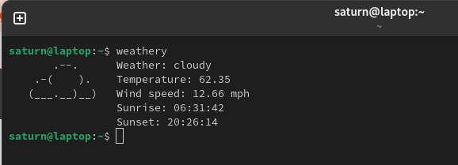

# Weathery

**[Inspired by](https://github.com/liveslol/rainy/)**

Neofetch-like, minimalistic, and customizable weather-fetching tool.



## Dependencies
* ```bash```
* ```make```

## Installation & Configuration
To install weathery, clone or download the repo, ```cd``` into it and just run ```make install``` (you can run ```make uninstall``` to uninstall it)

**Before usage, you need to configure it**

* First create an [OpenWeatherMap](https://home.openweathermap.org/users/sign_up) account, go to [API keys](https://home.openweathermap.org/api_keys) and get your key.
* Then edit ```/usr/local/bin/weathery``` and set the API key, city and time difference in the config section. (You can also configure this prior to ```make install```)
* You can also set if you want to show city name or / and the current date if you want to.

## Usage
When set up correctly, you can just go to your terminal and type ```weathery```

What if there's an update? You can just update your local git clone and sudo make again (you can also edit the config of the git clone you you don't have to set it every time you sudo make)
